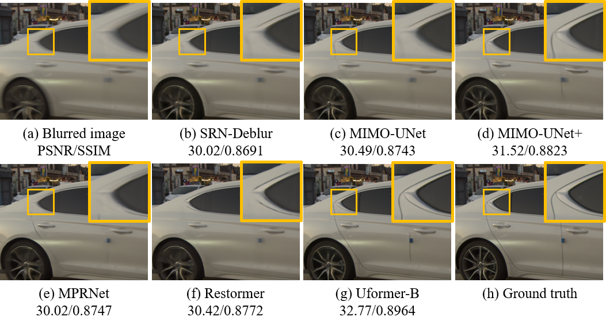

## Realistic Blur Synthesis for Learning Image Deblurring 
##### [Project](http://cg.postech.ac.kr/research/rsblur/) | [Paper](http://cg.postech.ac.kr/research/rsblur/assets/pdf/RSBlur.pdf) | [Supple](http://cg.postech.ac.kr/research/rsblur/assets/pdf/RSBlur-supp.pdf)

### Official Implementation of ECCV Paper 

> Realistic Blur Synthesis for Learning Image Deblurring<br>
> Jaesung Rim, Geonung Kim, Jungeon Kim, [Junyong Lee](https://junyonglee.me/), [Seungyong Lee](http://cg.postech.ac.kr/leesy/), [Sunghyun Cho](https://www.scho.pe.kr/). <br>
> POSTECH<br>
> *IEEE European Conference on Computer Vision (**ECCV**) 2022*<br>

### Results with the proposed method.


<details>
<summary><strong>Results of analysis</strong> (click) </summary>

| CRF    | Interp. | Sat. | Noise | ISP | PSNR / SSIM    |
|--------|---------|------|-------|-----|----------------|
| Linear |         |      |       |     | 30.12 / 0.7727 |
| sRGB   |         |      |       |     | 30.90 / 0.7805 |
| sRGB   | ✓       |      |       |     | 30.20 / 0.7468 |
| sRGB   | ✓       |      | G     |     | 31.77 / 0.8275 |
| sRGB   | ✓       | Ours | G     |     | 31.83 / 0.8265 |
| sRGB   | ✓       | Ours | G+P   | ✓   | 32.06 / 0.8322 |

</details>

## Installation 

```bash
git clone https://github.com/rimchang/RSBlur.git
```

## Tested environment

We recommend a virtual environment using conda or docker.

##### SRN-Deblur
- Tensorflow 1.15
- cuda11.1

## Download

### Dataset [[Google Drive]](https://drive.google.com/drive/folders/1sS8_qXvF4KstJtyYN1DDHsqKke8qwgnT) [[Postech]](https://cgdata.postech.ac.kr/sharing/kWA6K6J5G)
<details>
<summary><strong>Descriptions</strong> (click) </summary>

- RSBlur
  - 13,358 pairs of real/synthetic blurred image and a corresponding GT image.
- RSBlur_additional
  - 8,821 additional images for learning based synthesis, additional synthetic images or etc.
  - Do not use it as additional real training images.
- RSBlur_sharps
  - All of sharp image sequneces.
- GoPro_INTER_ABME
  - Synthetic blur dataset using the GoPro and the ABME method.
- GoPro_U
  - Synthetic blur dataset using the GoPro and synthetic blur kernels.

#### RSBlur

```bash
# RSBlur.zip

RSBlur
├── 0001
│   ├── 000001
│   │   ├── real_blur/real_blur.png # real blurred image
│   │   ├── avg65_img/avg_blur.png # synthetic blurred image using frame interpolation
│   │   ├── avg65_mask_100/avg_blur.png # saturation mask
│   │   ├── gt/gt_sharp.png # ground truth sharp image
...
```

#### GoPro_INTER_ABME

```bash
# GoPro_INTER_ABME.zip

GoPro_INTER_ABME
├── GOPR0372_07_00 
│   ├── 000001
│   │   ├── avg_inter_img/avg_blur.png # synthetic blurred image using frame interpolation
│   │   ├── avg_inter_mask_100/avg_blur.png # saturation mask
│   │   ├── gt/gt_sharp.png # ground truth sharp image
...
```

#### GoPro_U

```bash
# GoPro_U.zip

GoPro_U
├── centroid_blurred_img
│   ├── 0_GOPR0372_07_00_000047_003754_kernel_25_blurred.png # synthetic blurred image using a synthetic blur kernel
│   ...
├── centroid_blurred_mask_100
│   ├── 0_GOPR0372_07_00_000047_003754_kernel_25_blurred.png # saturation mask
│   ...
├── target_img
│   ├── 0_GOPR0372_07_00_000047_003754_kernel_25_gt.png # ground truth sharp image
│   ...
```
</details>


### Pre-trained models [[Google Drive]](https://drive.google.com/drive/folders/1_KvsvGSxI4szacdmIgGhzue88lGcZQmU) [[Postech]](https://cgdata.postech.ac.kr/sharing/NkEspVu9f)
<details>
<summary><strong>Descriptions</strong> (click) </summary>

- SRN-Deblur_RSBlur_real : Trained on real set of the RSBlur.
- SRN-Deblur_RSBlur_syn_with_ours : Trained on synthetic set of the RSBlur with our synthesis pipeline.
- SRN-Deblur_GoPro_ABME_with_ours : Trained on GoPro_INTER_ABME with our synthesis pipeline.
- SRN-Deblur_GoPro_U_with_ours : Trained on GoPro_U with our synthesis pipeline.
</details>

## Training

```bash
# ./SRN-Deblur-RSBlur
# All datasets should be located in SRN-Deblur-RSBlur/dataset

# RSBlur
python run_model.py --phase=train --checkpoint_path=0719_SRN-Deblur_RSBlur_real --sat_synthesis=None --noise_synthesis=None --datalist=../datalist/RSBlur/RSBlur_real_train.txt --gpu=0
python run_model.py --phase=train --checkpoint_path=0719_SRN-Deblur_RSBlur_syn_with_ours --sat_synthesis=sat_synthesis --noise_synthesis=poisson_RSBlur --cam_params_RSBlur=1 --datalist=../datalist/RSBlur/RSBlur_syn_train.txt --gpu=0

# GoPro_INTER_ABME
python run_model.py --phase=train --checkpoint_path=0719_SRN-Deblur_GoPro_ABME_with_ours --target_dataset=RealBlur --sat_synthesis=sat_synthesis --noise_synthesis=poisson_gamma --cam_params_RealBlur=1 --adopt_crf_realblur=1 --datalist=../datalist/GoPro/GoPro_INTER_ABME_train.txt --gpu=0

# GoPro_U
python run_model.py --phase=train --checkpoint_path=0719_SRN-Deblur_U_with_ours --target_dataset=RealBlur --sat_synthesis=sat_synthesis --noise_synthesis=poisson_gamma --cam_params_RealBlur=1 --adopt_crf_realblur=1 --datalist=../datalist/GoPro/GoPro_U_train.txt --gpu=0
```

## Testing

```bash
# ./SRN-Deblur-RSBlur
# All datasets should be located in SRN-Deblur-RSBlur/dataset

# RSBlur
python run_model.py --phase=test --checkpoint_path=SRN-Deblur_RSBlur_real --datalist=../datalist/RSBlur/RSBlur_real_test.txt --gpu=0
python run_model.py --phase=test --checkpoint_path=SRN-Deblur_RSBlur_syn_with_ours --datalist=../datalist/RSBlur/RSBlur_real_test.txt --gpu=0

# RealBlur
python run_model.py --phase=test --checkpoint_path=SRN-Deblur_GoPro_ABME_with_ours --datalist=../datalist/RealBlur_J_test_list.txt --gpu=0
python run_model.py --phase=test --checkpoint_path=SRN-Deblur_GoPro_U_with_ours --datalist=../datalist/RealBlur_J_test_list.txt --gpu=0
```

## Evaluation

```bash
# ./evaluation

python evaluate_RSBlur.py --input_dir=../SRN-Deblur-RSBlur/testing_res/SRN-Deblur_RSBlur_real --gt_root=../SRN-Deblur-RSBlur/dataset/RSBlur;
python evaluate_RealBlur.py --input_dir=../SRN-Deblur-RSBlur/testing_res/SRN-Deblur_U_with_ours --gt_root=../SRN-Deblur-RSBlur/dataset/RealBlur-J_ECC_IMCORR_centroid_itensity_ref;
```

## Real-world Deblurring Benchmark

We provide an additional deblurring benchmark to provide the basis for future deblurring research.
All below models are trained on real blurred images of the RSBlur training set.



<details>
<summary><strong>Results of benchmark</strong> (click) </summary>

| Methods        | PSNR / SSIM     | Link |
|----------------|-----------------|-------------------------|
| **Uformer-B**  | 33.98 / 0.8660  | [Result](https://drive.google.com/file/d/14x-9YsQNKZh-KaiSKe2SCZF-UDaje0Fa/view?usp=sharing) / [Weight](https://drive.google.com/file/d/19UWrCiiTMhxxzIiJ9yV2pMnhr8OCo3sk/view?usp=sharing) / [Test Code](https://drive.google.com/file/d/1Oz-BHl4yrZ0nKG8LUn5TiOpqloBVT2wa/view?usp=sharing)         |
| **Restormer**  | 33.69 / 0.8628  | [Result](https://drive.google.com/file/d/1RwVAtYM3nlNDqqViWU8w56ud8z7MggEa/view?usp=sharing) / [Weight](https://drive.google.com/file/d/1u-sJVg3_wA4Hy8EyZokHOLs3cwfp2Bif/view?usp=sharing)         |
| **MPRNet**     |  33.61 / 0.8614 | [Result](https://drive.google.com/file/d/1C4R6qDjis7Bcbt43CFeAu_I4C1dUBArR/view?usp=sharing) / [Weight](https://drive.google.com/file/d/1C7UMsIwRIWsABSm_iNjNHzZzzF9vK459/view?usp=sharing)         |
| **MiMO-UNet+** | 33.37 / 0.8560  | [Result](https://drive.google.com/file/d/1BzsV3CXg7Uv0WHKOUqf4p4bafPTZKiMz/view?usp=sharing) / [Weight](https://drive.google.com/file/d/1vCqjuPp8upvBSzr-tTsfK7pYuOHsOu5S/view?usp=sharing)         |
| **MiMO-UNet**  | 32.73 / 0.8457  | [Result](https://drive.google.com/file/d/11kxkBUWLBEh-yPTiSHt5n1pmUPs5yk4h/view?usp=sharing) / [Weight](https://drive.google.com/file/d/1W45a7neiC8TTG2B1qt0CKA-naiRFxZtM/view?usp=sharing)         |
| **SRN-Deblur** | 32.53 / 0.8398  | [Result](https://drive.google.com/file/d/1i9rjHwyxLTkLHdADsXQxUIz5txsid5UR/view?usp=sharing) / [Weight](https://drive.google.com/file/d/1x-_EIwv0a67h2_Eea9-2ybSIbJ13KBKY/view?usp=sharing)         |

</details>


## License

The RSBlur dataset is released under CC BY 4.0 license.

## Acknowledment

The code is based on the [SRN-Deblur](https://github.com/jiangsutx/SRN-Deblur), [CBDNet](https://github.com/GuoShi28/CBDNet) and [UID](https://github.com/timothybrooks/unprocessing).

## Citation

If you use our dataset for your research, please cite our papers.

```bibtex
@inproceedings{rim_2022_ECCV,
 title={Realistic Blur Synthesis for Learning Image Deblurring},
 author={Jaesung Rim, Geonung Kim, Jungeon Kim, Junyong Lee, Seungyong Lee, Sunghyun Cho},
 booktitle={Proceedings of the European Conference on Computer Vision (ECCV)}
 year={2022}
}
```
